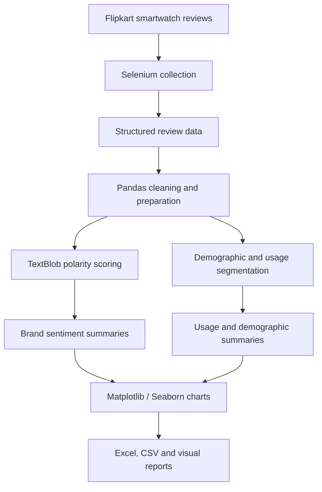

<div align="center">
⌚ Smartwatch Trend Analysis
Turning customer reviews into sentiment, usage & market insights


A Python-based review analytics project exploring customer sentiment, smartwatch usage patterns, demographic segments, and brand-level comparisons.
</div>
---
🧭 Explore the project
<details open>
<summary><strong>📌 Quick navigation</strong></summary>
✨ Project overview
🔎 What this project explores
🧰 Tech stack
🔄 Analysis workflow
📁 Repository guide
🚀 Run it locally
📊 Outputs
⚠️ Methodology note
🛠️ Future improvements
</details>
✨ Project overview
This project analyzes smartwatch customer reviews collected from Flipkart and turns the data into structured insights. The workflow combines browser automation, data cleaning, sentiment polarity analysis, demographic segmentation, and visual reporting.
The project covers 10 smartwatch brands, including Samsung, Apple, boAt, Redmi, Fossil, Fitbit, Amazfit, Boult, Fire-Boltt, and Google. The archive includes notebooks, intermediate datasets, charts, and Excel/CSV reports.
> **Project goal:** make large collections of customer reviews easier to explore through sentiment summaries, demographic breakdowns, and visual comparisons.
🔎 What this project explores
<details>
<summary><strong>💬 Sentiment analysis</strong></summary>
Uses TextBlob polarity scores to classify review text as Positive, Neutral, or Negative, then summarizes sentiment across brands.
</details>
<details>
<summary><strong>👥 Demographic analysis</strong></summary>
Uses Pandas to segment review data by available attributes such as state/location, age group, gender, and occupation.
</details>
<details>
<summary><strong>📈 Brand and trend comparisons</strong></summary>
Creates visual summaries to compare sentiment and review patterns across smartwatch brands and time-related categories present in the data.
</details>
<details>
<summary><strong>📊 Visual reporting</strong></summary>
Uses Matplotlib and Seaborn to produce charts for sentiment, usage, demographic patterns, and market-trend analysis.
</details>
🧰 Tech stack
Technology	How it is used
Python	Core programming language
Selenium	Browser automation for review collection
Pandas	Cleaning, grouping, aggregation, and file handling
NumPy	Random selection of time-related labels in the market-trend notebook
TextBlob	Review polarity scoring and sentiment labels
Matplotlib	Data visualization
Seaborn	Statistical visualization
Jupyter Notebook	Interactive analysis and experimentation
Excel / CSV	Data storage, summaries, and reporting
🔄 Analysis workflow

<details>
<summary><strong>🧪 Expand the workflow details</strong></summary>
Collect: automate browser interactions to gather review data.
Prepare: load and organize data using Pandas.
Score: calculate TextBlob polarity and map scores to sentiment categories.
Segment: group records by brand and available demographic fields.
Visualize: create charts for comparison and exploration.
Export: save analysis outputs in chart, Excel, and CSV formats.
</details>
📁 Repository guide
File / folder	Purpose
`Multiple Reviews.ipynb`	Review collection workflow
`Sentiment_Analysis.ipynb`	Sentiment analysis
`Trend_Analysis.ipynb`	Trend analysis
`Market_Trend_analysis.ipynb`	Market-trend workflow
`Usage_and_market_trend_analysis(actual).ipynb`	Usage and market-trend analysis
`sentiment_sales_analysis(actual).ipynb`	Sentiment and sales analysis
`CSV and Excel Files/`	Datasets, intermediate files, and reports
`Total Sales and Sentiment Analysis/`	Exported sentiment and demographic charts
`Total Trend Analysis/`	Exported trend charts
`Total Usage Analysis/`	Exported usage charts
<details>
<summary><strong>🗂️ About the notebooks and outputs</strong></summary>
The repository contains multiple notebooks and exported artifacts, including intermediate files and Jupyter checkpoint copies. Some notebooks may overlap in purpose. Review the notebook cells and input paths before rerunning a workflow from scratch.
</details>
🚀 Run it locally
1. Get the project
```bash
git clone <your-repository-url>
cd Trend-Analysis-main
```
Or download and extract the ZIP archive.
2. Create a virtual environment (recommended)
Windows
```bash
python -m venv .venv
.venv\Scripts\activate
```
macOS / Linux
```bash
python3 -m venv .venv
source .venv/bin/activate
```
3. Install the main dependencies
```bash
pip install pandas numpy matplotlib seaborn textblob selenium openpyxl jupyter
```
Some notebooks may require additional packages depending on the cells you run.
4. Launch Jupyter
```bash
jupyter notebook
```
Open the notebook you want to explore and run its cells in order.
<details>
<summary><strong>⚙️ Before running the notebooks</strong></summary>
Check and update any machine-specific file paths.
Confirm that the input datasets are available at the paths referenced in each notebook.
Selenium workflows may require a compatible browser and browser-driver configuration.
Website structure and access policies can change, so scraping code may need maintenance.
Avoid committing credentials, private data, or unnecessary personal information.
</details>
📊 Outputs
The archive includes visual and tabular outputs intended to help explore:
Sentiment distribution and brand comparisons
Review patterns across demographic groups
Usage-related summaries
Time/quarter-related trend charts
Excel and CSV analysis reports
The exact outputs depend on the notebook and dataset version used.
⚠️ Methodology note
Important: the `Market_Trend_analysis.ipynb` workflow uses `numpy.random.choice()` to assign time-related values such as seasons, months, and years to records. These generated values are not verified review timestamps. Therefore, charts based on those assigned values should be treated as illustrative analysis, not evidence of actual historical market movement.
Other limitations to keep in mind:
TextBlob polarity is an approximate sentiment signal and may miss sarcasm, context, or domain-specific meaning.
Demographic fields and data completeness can vary across files.
Random assignments can change between runs unless a random seed is set.
Review data and scraping results should be validated before reporting totals or drawing conclusions.
🛠️ Future improvements
[ ] Use verified review dates for genuine time-series analysis.
[ ] Set a random seed when randomization is intentionally used.
[ ] Consolidate repeated notebook logic into reusable Python functions.
[ ] Add a `requirements.txt` with pinned dependencies.
[ ] Replace machine-specific paths with configurable relative paths.
[ ] Add data-quality checks and clearer logging.
[ ] Evaluate sentiment labels against a manually reviewed sample.
[ ] Remove redundant checkpoints and temporary files from the public repository.
